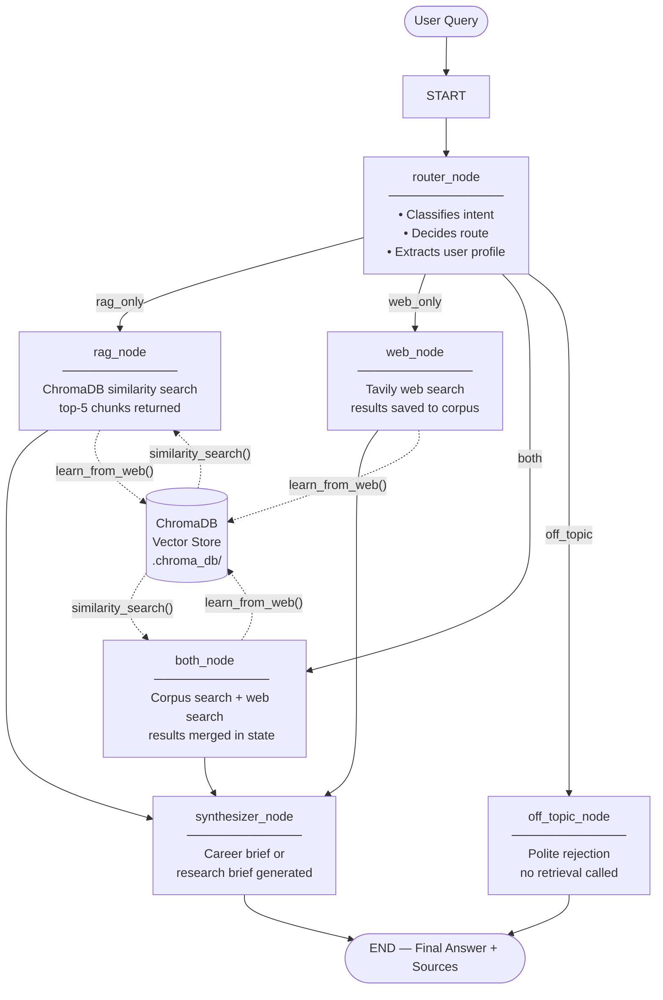

# Deep Research Agent: Career & Technology Intelligence Agent

> An agentic AI system built with **LangGraph**, **LangChain**, **ChromaDB**, and **Tavily** that autonomously routes research queries, retrieves from an internal knowledge base and the live web, and generates structured career and technology intelligence briefs.

---

## Project Overview

The **Career & Technology Intelligence Agent** is a CLI-based agentic AI system that helps students and early-career developers navigate the AI and software industry. It can:

- **Research career paths** — AI Engineer, ML Engineer, Data Engineer roadmaps
- **Analyze skill gaps** — compare a user's stated skills against target role requirements
- **Prepare for interviews** — technical questions, behavioral frameworks, ML system design
- **Track technology trends** — agentic AI frameworks, LLM ecosystem, tooling landscape
- **Research internships and jobs** — strategies, markets, and company intelligence

The system uses **LangGraph** as its reasoning backbone, **RAG** (Retrieval-Augmented Generation) over a curated 25-document corpus as its internal knowledge, **Tavily** for live web search, and an **LLM synthesizer** (via GitHub Models) to produce structured, actionable research briefs.

Every query is handled end-to-end autonomously — from intent classification through retrieval to synthesis — with no manual intervention required.

---

## Why This Is an Agentic AI System

This is not a retrieval wrapper or a chatbot with a search button. It is an agentic system because:

### 1. Autonomous Decision-Making (Routing)
A **router node** powered by an LLM reads each query and decides — without user instruction — which retrieval strategy to use: corpus only, web only, both, or off-topic rejection. The decision is based on classified intent (`career_plan`, `skill_gap`, `interview_prep`, `tech_trend`, `job_research`, `general_research`, `off_topic`) and explicit routing rules encoded in the system prompt.

### 2. Multi-Tool Orchestration
The agent has access to two distinct retrieval tools — **ChromaDB vector search** (internal knowledge) and **Tavily web search** (live internet). It selects and calls these tools based on routing logic, not hardcoded rules. Both tools can be called in the same execution path when the query requires it.

### 3. Multi-Step Stateful Reasoning
The system uses a **typed state graph** (LangGraph `StateGraph`) that passes structured state between nodes. Each node reads the current state, performs its task, and returns an updated state. The final synthesizer node has full visibility into what every previous node produced before generating its output.

### 4. Self-Improving Memory
Every web search result that passes a novelty check is **automatically embedded and stored** in the vector database. The agent's internal knowledge grows with every query that hits the web — no manual intervention required.

### 5. Structured, Actionable Output
The synthesizer does not echo back raw retrieval results. It produces a formatted intelligence brief with an executive summary, separated corpus and web findings, skill gap analysis, and a concrete recommended action plan — a non-trivial synthesis task driven by the LLM.

---

## Architecture Diagram



---

## LangGraph Flow

### State — `ResearchState`

All nodes share a single typed dictionary that flows through the entire graph. Defined in [src/agent.py](src/agent.py) as a `TypedDict`:

| Field | Type | Description |
|---|---|---|
| `query` | `str` | The user's original question |
| `route` | `str` | Router decision: `rag_only` / `web_only` / `both` / `off_topic` |
| `intent` | `str` | Classified intent type (see below) |
| `route_reason` | `str` | One-sentence explanation of the routing decision |
| `rag_result` | `str` | Retrieved corpus chunks with relevance scores |
| `web_result` | `str` | Formatted Tavily results (title + URL + content) |
| `sources` | `list` | Parsed `[{title, url}]` list for citation output |
| `profile_summary` | `str` | Skills/background extracted from the user's query |
| `skill_gap` | `str` | Identified skill gaps (used by synthesizer) |
| `recommendations` | `list` | Concrete action items (used by synthesizer) |
| `final_answer` | `str` | The final structured research brief |

### Intent Types

The router classifies every query into one of seven intent categories:

| Intent | Description | Default Route |
|---|---|---|
| `career_plan` | Learning roadmap or multi-week career plan | `both` |
| `job_research` | Internship/job listings, company research | `both` |
| `skill_gap` | Current skills vs target role comparison | `both` |
| `interview_prep` | Technical or behavioral interview preparation | `rag_only` or `both` |
| `tech_trend` | Technology/AI/software trend analysis | `both` |
| `general_research` | General AI/tech/software research | `rag_only` or `both` |
| `off_topic` | Unrelated to AI, tech, software, or careers | `off_topic` |

### Nodes

| Node | Function | Goes To |
|---|---|---|
| `router_node` | LLM classifies intent, decides route, extracts profile | conditional edge |
| `rag_node` | ChromaDB similarity search, returns top-5 chunks | `synthesizer_node` |
| `web_node` | Tavily search, saves results to corpus | `synthesizer_node` |
| `both_node` | Runs both corpus search and web search | `synthesizer_node` |
| `off_topic_node` | Returns rejection message, sets `final_answer` | `END` |
| `synthesizer_node` | LLM generates structured career/research brief | `END` |

### Edges

```
START            → router_node          (unconditional)
router_node      → rag_node             (conditional: route == "rag_only")
router_node      → web_node             (conditional: route == "web_only")
router_node      → both_node            (conditional: route == "both")
router_node      → off_topic_node       (conditional: route == "off_topic")
rag_node         → synthesizer_node     (unconditional)
web_node         → synthesizer_node     (unconditional)
both_node        → synthesizer_node     (unconditional)
synthesizer_node → END                  (unconditional)
off_topic_node   → END                  (unconditional — skips synthesizer)
```

### Conditional Edge

The `route_decision` function in [src/agent.py](src/agent.py) reads `state["route"]` and returns one of four branch labels. LangGraph uses this to select the next node. If the state contains an unexpected value, the function falls back to `"both"` — the agent never deadlocks.

### Fault Tolerance

- The entire LLM call and JSON parse in `router_node` is wrapped in `try/except`. On any failure, defaults kick in: `intent = "general_research"`, `route = "both"`.
- `retrieve()` in the RAG pipeline wraps all Chroma operations in `try/except` and returns an error string — it never raises into the graph.
- `search_web()` catches all Tavily exceptions and returns a formatted error string.

---

## RAG System

### Corpus

The internal knowledge base lives in `corpus/` and contains **25 curated `.txt` documents**:

**Original AI/ML foundations (15 docs):**
`01_rag_overview.txt`, `02_langgraph.txt`, `03_llm_agents.txt`, and 12 additional AI/ML topic files.

**Career intelligence documents (10 docs):**

| File | Content |
|---|---|
| `career_ai_engineer_roadmap.txt` | 12-month AI Engineer learning path, salary ranges, top employers |
| `career_data_engineer_roadmap.txt` | Data pipeline engineering path, tools, certifications |
| `career_ml_engineer_roadmap.txt` | ML Engineer specializations, MLOps, deployment |
| `ats_resume_guidelines.txt` | ATS optimization, keyword strategy, formatting rules |
| `github_portfolio_guidelines.txt` | Portfolio project ideas, README structure, commit hygiene |
| `linkedin_profile_optimization.txt` | Headline, About section, algorithm signals |
| `technical_interview_prep.txt` | DSA patterns, ML concepts, system design framework |
| `behavioral_interview_prep.txt` | STAR method, question bank, company-specific values |
| `internship_search_strategy.txt` | Phased search strategy, job boards, referral tactics |
| `skill_gap_analysis_framework.txt` | 5-step gap analysis methodology, priority matrix |

### Vector Store

- **Engine:** ChromaDB (local, persistent at `.chroma_db/`)
- **Embedding model:** `text-embedding-3-small` via GitHub Models API
- **Chunk size:** 800 tokens with 100-token overlap
- **Collection:** `research_corpus`
- **Retrieval:** top-5 most similar chunks per query, with relevance scores

### Ingestion Flow

1. `ingest()` scans `corpus/` recursively for `.txt` files
2. Already-indexed files are skipped (tracked by filename in ChromaDB metadata)
3. New files are split into chunks by `RecursiveCharacterTextSplitter`
4. Chunks are embedded and stored in ChromaDB
5. `corpus/web_learned/` is created automatically if it doesn't exist

### Retrieval

`retrieve(query)` embeds the user query and runs `similarity_search_with_score()` against the vector store. Results are formatted with source filename, origin label (`corpus` or `web_learned`), and relevance percentage.

---

## Web Search

The web search tool is implemented in [src/web_search.py](src/web_search.py) and uses the **Tavily Search API**.

- **Search depth:** `advanced` (full page content, not snippets)
- **Results per query:** up to 5
- **Output format:** structured blocks with `[Result N]` header, `URL:` line, and first 500 characters of content
- **Source parsing:** `get_sources()` extracts `[{title, url}]` pairs for citation display
- **Triggered when:** `route` is `web_only` or `both`

If `TAVILY_API_KEY` is missing or invalid, `search_web()` returns a graceful fallback message and the agent continues with corpus-only results — it does not crash.

---

## Self-Growing Knowledge System

Every time the agent performs a web search, `learn_from_web()` in [src/rag_pipeline.py](src/rag_pipeline.py) processes the results:

1. Each web result block is compared to the existing vector store using similarity search
2. If the most similar existing chunk has similarity **below 85%**, the block is considered novel
3. Novel blocks are written to `corpus/web_learned/` as `.txt` files with query and timestamp metadata
4. The block is embedded and immediately added to the ChromaDB collection

This means the agent's internal knowledge improves with every query that triggers a web search. Topics that are frequently queried become part of the permanent corpus, making future queries faster and richer.

The `corpus/web_learned/` directory is excluded from Git (`.gitignore`) because it is auto-populated at runtime and may contain user-specific query data.

---

## Match Score & Career Recommendations System

The agent includes a **role-aware, category-based Match Score system** ([src/scoring.py](src/scoring.py)) that runs automatically for career-related queries. No external ML dependencies — purely rule-based and explainable.

### How It Works

1. **Role detection** — `detect_target_role()` scans the query with ordered regex patterns. "machine engineer" normalises to Mechanical Engineer; "ML engineer" maps to Machine Learning Engineer; unrecognised roles default to AI Engineer.
2. **Skill extraction with synonyms** — `extract_skills_from_text()` matches 70+ known skill tokens (including multi-word phrases like "digital twin") then maps each through `SKILL_SYNONYMS` to a canonical category name:
   - `opencv` / `yolo` / `yolov8` → `computer vision`
   - `langchain` / `langgraph` / `rag` / `llm` → `agentic ai`
   - `fastapi` / `flask` / `django` → `backend api`
   - `docker` / `kubernetes` → `deployment`
   - `aws` / `gcp` / `azure` → `cloud`
   - `pandas` / `numpy` → `data processing`
   - `react` / `javascript` / `html` → `frontend`
   - `pytest` / `selenium` → `testing`
3. **Category-based scoring** — `compute_match_score()` compares normalised user skills against the flattened target skill categories. Three weighted dimensions:
   - **Skills Match** (60%) — % of target category skills the user covers
   - **Experience Breadth** (25%) — heuristic based on distinct canonical skill count
   - **Market Demand** (15%) — derived from role metadata (AI/Data/Software = High)
4. **Rich output** — the result includes `strong_skills`, `missing_skills`, `quick_wins` (top-3 learnable gaps with free resources), and a role-specific `project_recommendation`.
5. **Injection** — the Match Score block is inserted before `## 5. Recommended Action Plan` in the career brief.

### Supported Roles and Skill Categories

| Role | Skill Categories |
|---|---|
| AI Engineer | core (python, ML, DL, agentic ai) · vision · tools (pytorch, tensorflow) · data · deployment |
| ML Engineer | core · tools (pytorch, tensorflow, scikit-learn, mlflow) · data · deployment |
| Data Engineer | core (python, sql, etl, data modeling) · tools (airflow, spark, dbt) · deployment |
| Software Engineer | core (python, sql, git, algorithms) · backend api · frontend · testing · deployment |
| Mechanical Engineer | core (cad, thermodynamics, materials, manufacturing) · tools (solidworks, autocad, matlab) · modern (digital twin, python) |

### Triggered For

Intents: `skill_gap`, `career_plan`, `job_research`, `tech_trend`, `interview_prep`

### When No User Skills Are Detected

If the query contains no detectable skills (e.g. *"how can I become a machine engineer?"*), the system **never produces a fake 0% score**. Instead it:
- Identifies the target role from the query
- Shows the full categorised skill requirements for that role
- Asks the user to include their current skills in the next query for a real score

### Extra Career Suggestions

For all career and technology intent queries, the LLM synthesizer automatically adds a **§ 6. Extra Career Suggestions** section to every research brief containing:
- **Skill to learn next** — one specific recommendation with a free resource
- **Mini-project to build** — one concrete, completable project idea
- **GitHub action** — one thing to publish or improve right now
- **Market signal to track** — one newsletter, job board, or trend to monitor

---

## Future GUI

A Streamlit web interface is planned. See [GUI_PLAN.md](GUI_PLAN.md) for the full component breakdown, layout wireframe, and implementation order.

The CLI-based agent is the primary interface for the current submission.

---

## Installation & Setup

### Prerequisites

- Python 3.10 or higher
- A **GitHub Personal Access Token** (for GitHub Models API — LLM inference + embeddings)
- A **Tavily API key** (for web search — free tier available)

### Step 1 — Clone the Repository

```bash
git clone <your-repo-url>
cd deep-research-agent
```

### Step 2 — Create Virtual Environment

```bash
# Create
python -m venv venv

# Activate — Windows
venv\Scripts\activate

# Activate — macOS / Linux
source venv/bin/activate
```

### Step 3 — Install Dependencies

```bash
pip install -r requirements.txt
```

### Step 4 — Configure Environment Variables

Copy the example file and fill in your real keys:

```bash
# Windows
copy .env.example .env

# macOS / Linux
cp .env.example .env
```

Edit `.env`:

```env
GITHUB_TOKEN=your_actual_github_token
TAVILY_API_KEY=your_actual_tavily_key
```

- **GitHub Token:** [github.com/settings/tokens](https://github.com/settings/tokens) — create a classic token with `models:read` permission (or a fine-grained token with GitHub Models access)
- **Tavily API Key:** [tavily.com](https://tavily.com) — free tier includes 1,000 searches/month

The `.env` file is listed in `.gitignore` and will never be committed.

### Step 5 — Build the Vector Store

**Required on first run** and whenever you add new corpus documents:

```bash
python main.py --ingest
```

Expected output:
```
📂 Scanning corpus/ for new documents...
   📄 25 new documents → ~180 chunks
   ✅ Vector store now has 180 total chunks
```

---

## Streamlit Web GUI

A polished web interface is available as a separate entry point — it does not modify or replace the CLI.

### Install Streamlit

Streamlit is included in `requirements.txt`. If you installed dependencies already, it is ready:

```bash
pip install -r requirements.txt   # includes streamlit>=1.35.0
```

### Launch the GUI

```bash
# Activate venv first
venv\Scripts\activate      # Windows
source venv/bin/activate   # macOS / Linux

streamlit run app.py
```

The browser opens automatically at `http://localhost:8501`.

### What the GUI Shows

| Panel | Content |
|---|---|
| **Sidebar — Roles** | Supported role descriptions (AI Engineer, Data Engineer, etc.) |
| **Sidebar — Knowledge Base** | Live ChromaDB chunk counts (corpus + web-learned) |
| **Sidebar — Configuration** | API key status indicators (✅ / ❌) |
| **Example Queries** | Dropdown to load 5 pre-written queries |
| **Query Input** | Text area — type freely or load an example |
| **Agent Decision** | Intent label, route label, routing reason |
| **Match Score Card** | Overall %, Skills Match %, Experience %, Market Demand + progress bar |
| **Research Brief** | Full Markdown output from the synthesizer |
| **Web Sources** | Collapsible expander with titled, clickable source URLs |

### GUI vs CLI

| Feature | CLI (`main.py`) | GUI (`app.py`) |
|---|---|---|
| Interactive loop | ✅ | — |
| Single query | ✅ | ✅ |
| `--ingest` rebuild | ✅ | — (run from CLI) |
| Match Score display | Text output | Metric cards + progress bar |
| Sources | Inline text | Collapsible expander |
| Corpus stats | — | Live sidebar widget |

---

## CLI Usage

### Interactive Mode

```bash
python main.py
```

Launches a prompt loop. Type any research question and press Enter. Type `quit` to exit.

### Single Query Mode

```bash
python main.py "your research question here"
```

Processes one query and exits. Useful for scripting or quick lookups.

### Rebuild Vector Store

```bash
python main.py --ingest
```

Clears the existing vector store and re-indexes all corpus documents from scratch. Use this after adding new documents to `corpus/`.

---

## Demo Queries

### RAG Only — Interview Preparation (corpus has full coverage)

```bash
python main.py "Explain the STAR method for behavioral interviews and give me 5 example questions I should prepare for."
```

**Expected:** `intent=interview_prep`, `route=rag_only` — pulls from `behavioral_interview_prep.txt` and related docs. No web call made.

---

### Web Only — Live Job Market (requires real-time data)

```bash
python main.py "What AI engineering internships are currently open at major tech companies in Europe?"
```

**Expected:** `intent=job_research`, `route=web_only` or `both` — live Tavily search for current openings.

---

### Both — Skill Gap Analysis (corpus framework + live market data)

```bash
python main.py "Analyze my skills: Python, FastAPI, SQL, YOLO, OpenCV, LangChain, Supabase. What gaps do I have for AI Engineer roles and what should I prioritize learning in the next 30 days?"
```

**Expected:** `intent=skill_gap`, `route=both` — corpus provides the skill requirements framework; web search adds current market intelligence.

---

### Match Score — Mechanical Engineer, No Skills Provided

```bash
python main.py "check the recent updates, how can i be a machine engineer with the newest informations"
```

**Expected:** `intent=tech_trend` or `career_plan`, `route=both` — "machine engineer" is normalised to **Mechanical Engineer**. Because no user skills appear in the query, the Match Score section shows the full Mechanical Engineer skill list and asks the user to provide their profile. No fake 0% score is generated.

---

### Match Score — Mechanical Engineer, Skills Provided

```bash
python main.py "I have AutoCAD, MATLAB, and Python experience. What gaps do I have to become a mechanical engineer?"
```

**Expected:** `intent=skill_gap`, `route=both` — role detected as **Mechanical Engineer**, skills extracted (`autocad`, `matlab`, `python`), score computed against `[cad, solidworks, autocad, matlab, python, simulation, manufacturing, thermodynamics, materials, digital twin]`.

---

### Off-Topic — Graceful Rejection

```bash
python main.py "Give me a pasta carbonara recipe with step-by-step instructions."
```

**Expected:** `intent=off_topic`, `route=off_topic` — no retrieval, no LLM synthesis. Agent returns a polite scope explanation.

---

## Assignment Requirement Checklist

- [x] **LangGraph `StateGraph` with multiple nodes** — `router`, `rag`, `web`, `both`, `off_topic`, `synthesizer` (6 nodes total)
- [x] **Conditional edge based on route decision** — `route_decision()` function branches to one of 4 paths after `router_node`
- [x] **LangChain LLM and tool abstractions** — `ChatOpenAI`, `OpenAIEmbeddings`, `Chroma`, `TextLoader`, `RecursiveCharacterTextSplitter` all used
- [x] **RAG over 15+ documents** — 25 `.txt` documents in `corpus/` (15 original AI/ML topics + 10 career intelligence docs)
- [x] **Web search tool integrated** — Tavily Search API in [src/web_search.py](src/web_search.py), `search_depth="advanced"`
- [x] **Demonstrable run using both RAG and web search** — `both_node` executes corpus retrieval and web search in the same invocation; see skill-gap demo query above
- [x] **`.env.example` included** — placeholder values only, safe to commit
- [x] **API keys excluded from Git** — `.env` listed in `.gitignore`, never tracked
- [x] **`AI_USAGE.md` included** — full academic integrity disclosure with tool-by-tool breakdown

---

## Example Output

The following is a representative output for a `skill_gap` + `both` query:

```
═══════════════════════════════════════════════════════
❓ Query: Analyze my skills: Python, FastAPI, SQL, YOLO, OpenCV.
   What gaps do I have for AI Engineer roles?
═══════════════════════════════════════════════════════

🎯 Intent:  skill_gap
🔀 Route:   both
💬 Reason:  Query requires corpus skill framework and live market data.

📚🌐 Both node: corpus + web search...
   📂 Scanning corpus/ for new documents...
   ✅ Nothing new. Vector store has 183 chunks.
   🧠 Corpus update: +3 new block(s), 2 duplicate(s) skipped

✍️  Synthesizer: generating research brief...

═══════════════════════════════════════════════════════
📋 RESEARCH BRIEF
═══════════════════════════════════════════════════════

# Career & Technology Intelligence Brief

## 1. Executive Summary
You have a solid computer vision and API development foundation. The primary gaps
for AI Engineer roles are LLM/GenAI tooling, cloud deployment, and MLOps practices —
areas that are explicitly required in 80%+ of current AI Engineer job descriptions.

## 2. Internal Knowledge Findings
- [Corpus] AI Engineers are expected to work with LLM APIs, RAG systems, and
  agentic frameworks (LangChain, LangGraph) — none of which appear in your current stack.
- [Corpus] FastAPI is a strong signal — it is the standard serving layer for AI APIs.
- [Corpus] SQL and Python are baseline requirements; your proficiency here is confirmed.
- [Corpus] YOLO/OpenCV positions you well for computer vision specialization within AI.

## 3. Live Web Findings
- [Web] Current AI Engineer job postings (2025) most frequently require: Python,
  PyTorch or TensorFlow, LangChain/LangGraph, vector databases, Docker, and
  at least one cloud platform (AWS/GCP/Azure).
- [Web] Hugging Face ecosystem knowledge (Transformers, PEFT, datasets) is
  appearing in 60%+ of mid-level AI Engineer descriptions.

## 4. Skill Gap / Opportunity Analysis
Confirmed strengths: Python, FastAPI, SQL, computer vision (YOLO, OpenCV)
Critical gaps for AI Engineer roles:
  ① LLM frameworks — LangChain, LangGraph (high priority)
  ② Vector databases — ChromaDB, Pinecone, or Weaviate (high priority)
  ③ PyTorch — expected for model work (high priority)
  ④ Docker — required for deployment (medium priority)
  ⑤ Cloud platform basics — AWS or GCP (medium priority)
  ⑥ MLOps — MLflow or W&B for experiment tracking (lower priority for junior roles)

## 5. Recommended Action Plan

**Week 1-2 (Quick wins):**
  1. Build a RAG system using LangChain + ChromaDB over any document set you care about
  2. Push to GitHub with a complete README and demo

**Week 3-4 (Core LLM tooling):**
  3. Add a LangGraph agent layer to your RAG system (router + synthesizer pattern)
  4. Call an LLM API (OpenAI or GitHub Models) from your FastAPI backend

**Week 5-6 (Deployment):**
  5. Containerize your project with Docker
  6. Deploy to a free cloud tier (Hugging Face Spaces or Railway)

**Week 7-8 (Portfolio polish):**
  7. Add experiment tracking with MLflow or Weights & Biases to any ML project
  8. Write a LinkedIn post about what you built — recruiters notice active builders

## 6. Sources
(Web references appended below)

📎 Web References
  [1] What does an AI Engineer do in 2025 — TechTarget
      https://www.techtarget.com/...
  [2] AI Engineer skills and salary report — Levels.fyi
      https://www.levels.fyi/...
```

---

## Project Structure

```
deep-research-agent/
├── main.py                          # CLI entry point (interactive / single / --ingest)
├── requirements.txt                 # Python dependencies
├── .env                             # API keys — NOT committed (in .gitignore)
├── .env.example                     # Safe placeholder template
├── AI_USAGE.md                      # Academic integrity disclosure
├── DEMO_QUERIES.md                  # Annotated query examples with expected routes
├── README.md                        # This file
│
├── src/
│   ├── __init__.py
│   ├── agent.py                     # LangGraph graph: state, nodes, edges
│   ├── rag_pipeline.py              # ChromaDB ingest / retrieve / learn_from_web
│   ├── web_search.py                # Tavily search wrapper + source parser
│   └── logger.py                    # JSON query logs + rotating agent.log
│
├── corpus/                          # RAG knowledge base (25 .txt files)
│   ├── 01_rag_overview.txt
│   ├── 02_langgraph.txt
│   ├── 03_llm_agents.txt
│   ├── ... (12 more AI/ML topic files)
│   ├── career_ai_engineer_roadmap.txt
│   ├── career_data_engineer_roadmap.txt
│   ├── career_ml_engineer_roadmap.txt
│   ├── ats_resume_guidelines.txt
│   ├── github_portfolio_guidelines.txt
│   ├── linkedin_profile_optimization.txt
│   ├── technical_interview_prep.txt
│   ├── behavioral_interview_prep.txt
│   ├── internship_search_strategy.txt
│   ├── skill_gap_analysis_framework.txt
│   └── web_learned/                 # Auto-populated at runtime — not committed
│
├── .chroma_db/                      # ChromaDB vector store — not committed
└── logs/                            # JSON query logs — not committed
```

---

## Future Improvements

- **Streaming output** — replace `graph.invoke()` with `graph.stream()` for token-by-token display; improves UX for long synthesis responses
- **User profile persistence** — save the user's stated skills and goals across sessions (SQLite or JSON) so every query benefits from prior context without re-stating background
- **Re-ranking** — add a cross-encoder re-ranking step between ChromaDB retrieval and the synthesizer; improves relevance ordering for long or ambiguous queries
- **Hybrid search** — combine vector similarity search with BM25 keyword search (ChromaDB supports this) for better precision on specific technical terms
- **REST API** — wrap the agent in a FastAPI endpoint so it can be consumed by a web or mobile frontend
- **Web UI** — a Streamlit or Gradio interface would make the tool accessible to non-CLI users
- **Conversation memory** — use LangGraph's built-in checkpointing to enable multi-turn conversations where the agent remembers earlier context in the session
- **Evaluation harness** — automated faithfulness and answer-relevance scoring using RAGAS or a custom LLM judge
